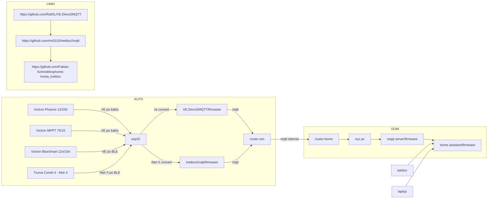

# esp

bla bla bla

```mermaid
flowchart LR
    p[Victron Phoenix 12/250]
    r[Victron MPPT 75/15]
    l[Victron BlueSmart 12v/15A]
    o[Truma Combi 4 - iNet X]
    esp32[esp32]
    click esp32 href "https://esphome.io/guides/getting_started_command_line.html" "instalacja"
    r-sim[router-sim]
    r-home[router-home]
    nuc[nuc pc]
    mqqt[mqqt server/firmware]
    click mqqt href "https://www.home-assistant.io/integrations/mqtt/" "doinstalowac w home assistant"
    ha[home assistant/firmware]
    click ha href "https://www.home-assistant.io/installation/"

    ve[VE.Direct2MQTT/firmware]
    click ve href "https://github.com/RalfJL/VE.Direct2MQTT" "dograć to "
    i2[inetbox2mqtt/firmware]
    click i2 href "https://github.com/mc0110/inetbox2mqtt" "This is a tooltip for a link"
    n1[https://github.com/RalfJL/VE.Direct2MQTT]
    n2[https://github.com/mc0110/inetbox2mqtt]
    n3[https://github.com/Fabian-Schmidt/esphome-truma_inetbox]


    subgraph AUTO
    p -->|VE po kablu| esp32 
    r -->|VE po kablu| esp32 
    l -->|VE po BLE| esp32 
    o -->|iNet X po BLE| esp32 
    esp32 -->|ve convert| ve
    esp32 -->|iNet X convert| i2 
    ve -->|mqtt|r-sim
    i2 -->|mqtt|r-sim
    end

    r-sim -->|mqtt internet| r-home

    subgraph DOM
    r-home --> nuc --> mqqt --> ha
    end

    telefon --> ha
    laptop --> ha

    subgraph LINKI

    n1 --> n2 --> n3
    end
```
