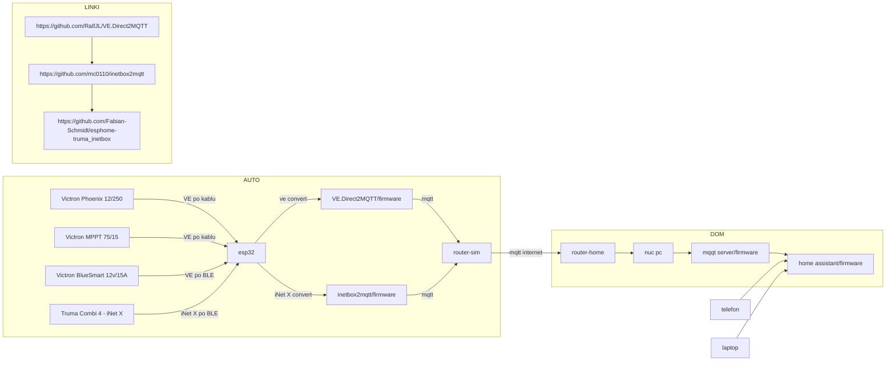

# esp

https://mermaid.live/edit#pako:eNqNVG1P2zAQ_itWPpOGhqFJ_TAJBpPYystoh6alqHIdp_HwS3AuDRPl8_7YftjOiRO1pUJUaeLcc77n7nxPngNmUh6MgkyamuXUAhnfzjTBX5HcCQbWaHKTG67FExnGUXx8eN_Ctocvb26m5ONxNDz2kOyhU1nxiXJRh_EKHU68h0mmtlKUfDZqIcgHEhJxxYH89DAvi6M4ae7ewqRgD62d5JZnZBbkAEU5iiI05kbxgTDRshIpL6MlBxB6OS8BmXk6Z0YpqtO5FJoPclByFuB-oRGXlP2ms8CXFJZCJdZUwJtlV2no4nd2t_aArliCf1Iwb1CPj5C4Gym5XXEbZcKqmlq-VUXjsFNEXdcDFzmkZSkwLw2uHqGBLy0FYXQZqUeAqMk8NW3upqaM1MTtI_2-rpicJtvA_mRy-t5UHKNscokcRxtkxZO788GZsJxBfPl9Ot3PsuK7LEsBebUY4NFEt1RmX8fRdhxfKFb_7y8BQ7qyRJzgKcLCPMVNQ_bSifgNOsUOh8PDaDNKQzbNRUnwokhnJIiCZMbiG07NQ8euh8l7C-hmJE7el0Pnf7TP_wtdCKrDCcuVSKEb-RCciOY-yr07kzZIWS2wcUVOTn5Mr72aSRh-Wt-dk8KQB7qQ1dqryc_427DcgE_H59ugacBWwHsd2rVzwjlgRqMyYI0zsYv6EL2H6ALgNoe7Nq0bZXazsNfMddo1orH2TsTpyWK31l7Tr_p1dn25qXm306m8eTaydYucvuIBLnmG37tNWNICTNGbdpjGF1ffLjqrHrZMcfs46uMHB4HiVlGR4if62ZlnAeQcMw9GTh88o5VsJP-CrrQCM_mjWTDCweAHQVWkFPiZoEipglFGZYnWgupfxnTvL_8BO9r6eQ

https://community.victronenergy.com/questions/184828/reading-victron-ble-broadcasts-with-arduino-esp32.html

https://community.victronenergy.com/questions/53269/vedirect-to-mqtt-gateway-using-esp32.html

bla bla bla
https://esphome.io/guides/getting_started_command_line.html

https://www.home-assistant.io/integrations/mqtt/

https://www.home-assistant.io/installation/

https://github.com/RalfJL/VE.Direct2MQTT

https://github.com/mc0110/inetbox2mqtt

https://github.com/Fabian-Schmidt/esphome-truma_inetbox

